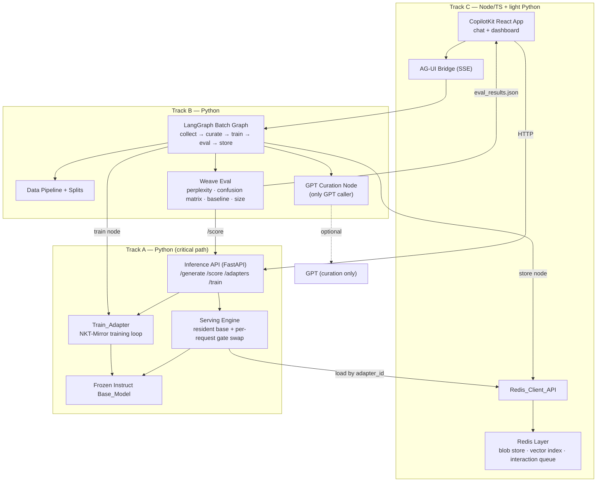

# Design Document

## Overview

WeaveSelf is a local, overnight "weight-memory" personalization engine. A single frozen
open-source instruct model (Base_Model) is specialized per unit (user or category) by tiny
(~100 KB) NKT-Mirror activation-gating adapters. Adapters are retrained in nightly batches
from accumulated interactions, served locally by swapping gate tensors against one resident
base model, and proven by an objective evaluation: held-out perplexity, a cross-unit
identification confusion matrix, and a comparison against a context-memory baseline at zero
extra context cost.

This design is organized to match the requirements' three parallel build tracks plus a
shared-contracts foundation. The central engineering tactic is **contract-first
parallelism**: Track 0 defines five frozen data/interface contracts (adapter file format,
inference API schema, Redis layout, training-pair schema, eval artifact schema). Each of the
three tracks owns one or two of those contracts, consumes the others through mock
dependencies until integration, and ships a standalone test plus a standalone fallback demo.

### Design Goals

- **De-risk the critical path first.** Track A custom serving (load frozen base once, swap
  ~100 KB gate tensors per request) and method reproduction are the riskiest work; the
  architecture isolates them so they can be verified before anything depends on them.
- **Never block a teammate.** All cross-track communication flows through the five Track 0
  contracts. A track that consumes an unfinished interface mocks it against the contract.
- **Make the proof the product.** The confusion matrix, perplexity comparison, and size
  chart are first-class artifacts (`eval_results.json`) with a fixed schema so the dashboard
  can render proof visuals before the real eval runs.
- **Honor the hard constraints.** Activation gating not LoRA; custom serving not multi-LoRA
  stacks; batch/overnight training not live; instruct model only; steer style/preferences
  not arbitrary facts; two-runtime (Node/TS + Python) bridged via AG-UI; GPT as curation
  node only.

### Key Design Decisions

| Decision | Rationale |
| --- | --- |
| Hand-rolled serving that mutates a resident base model's forward pass with per-request gate tensors | NKT-Mirror is activation gating, not LoRA; vLLM/LoRAX multi-LoRA serving cannot apply per-channel gates. Loading the base once and swapping ~100 KB tensors is the only path that scales to thousands of adapters. |
| `safetensors` + sidecar JSON for the Adapter_File | `safetensors` is the standard, safe tensor container; a separate JSON metadata file lets consumers read metadata (for the library view and routing) without deserializing tensors. |
| FastAPI + Pydantic for the Inference_API | Pydantic gives schema validation that directly enforces the Requirement 2 contract and produces field-named validation errors. |
| LangGraph state machine for the nightly batch | The batch is a linear pipeline (collect → curate → train → eval → store) with per-unit error isolation; LangGraph models this cleanly and is the agreed control plane. |
| Redis as adapter library + vector router + interaction queue | One store covers blob persistence, top-1 vector routing over unit-label embeddings, and the daily interaction queue, exposed behind one client API. |
| AG-UI (SSE) bridge between Node/TS CopilotKit and Python LangGraph | The two-runtime reality is unavoidable; AG-UI server-sent events are the supported bridge for the LangGraph-Python agent. |
| Adapter is built on the **instruct** base only | Measured NKT-Mirror ties LoRA on the instruct model and trails on the base model. |

## Architecture

### System Context



### Track Ownership and Contract Boundaries

| Contract (Track 0) | Owner | Primary consumers |
| --- | --- | --- |
| Req 1 — Adapter File Format | Track A | Track B (store), Track C (library view, serving load) |
| Req 2 — Inference API Schema | Track A | Track B (eval scoring, train), Track C (chat) |
| Req 3 — Redis Layout | Track C | Track A (load adapters), Track B (store adapters) |
| Req 4 — Dataset / Training-Pair Schema | Track B | Track A (train_adapter input) |
| Req 5 — Eval Artifact Schema | Track B | Track C (dashboard rendering) |

Until the Integration_Milestone, each consumer substitutes a **Mock_Dependency** built to the
contract: Track B and Track C run against a stub inference API and fixture `eval_results.json`;
Track A trains against tiny local fixture datasets; the LangGraph graph runs against a mock
`train_adapter`.

### Runtime Topology

Two operating system processes plus Redis:

1. **Python ML process** — hosts the Inference_API (FastAPI/uvicorn), the resident Base_Model,
   the Serving_Engine, Train_Adapter, and the LangGraph agent reachable over AG-UI.
2. **Node/TS process** — hosts the CopilotKit runtime and the React frontend; talks to the
   Python LangGraph agent over AG-UI (SSE) and to the Inference_API over HTTP.
3. **Redis** — adapter blob store, `adapter:index` vector index, and `interactions:<unit_label>`
   queues.

Training is strictly batch. The LangGraph_Batch_Graph runs as an overnight job and blocks live
chat requests from triggering graph execution; the demo is time-compressed using pre-baked
Adapter_Files keyed by `day_index`.

### Critical-Path Build Order

Per Requirement 22, Track A serving (Req 7) and method reproduction (Req 6) are built and
verified first. Tracks B and C proceed against mocks in parallel. If Track A serving cannot be
verified, the system records that downstream integration is blocked and falls back to the
per-track standalone demos (Req 23), with the Track B confusion matrix as the single
highest-priority independently-demoable artifact.

## Components and Interfaces

### Track A — Model & Serving

#### Serving_Engine

Loads the Base_Model exactly once per process. Maintains an in-memory cache of loaded gate
tensors keyed by `adapter_id`. Applies gates by registering forward hooks (or equivalent
per-channel scaling) on the resident model's layers for the duration of a single request, then
clears them so the next request is unaffected.

```python
class ServingEngine:
    def __init__(self, base_model_id: str): ...
    def load_adapter(self, adapter_id: str) -> GateTensors:
        """Load and cache gate tensors for adapter_id. Raises AdapterNotLoadable if absent."""
    def list_adapters(self) -> list[str]:
        """Return currently loadable adapter_id values."""
    def generate(self, prompt: str, adapter_id: str | None, max_new_tokens: int) -> Generation:
        """Apply gates (if adapter_id) for this request only, then generate."""
    def score(self, prompt: str, target: str, adapter_id: str | None) -> ScoreResult:
        """Teacher-forced NLL and perplexity of target given prompt under optional adapter."""
```

Behavior contract: base loaded once (7.1); gates applied per request when `adapter_id` set
(7.2); pure base when null (7.3); adapter output differs from base output for every prompt
(7.4); unknown `adapter_id` yields an error naming the missing id (7.5).

#### Train_Adapter

```python
def train_adapter(dataset_path: str, unit_label: str, unit_type: str) -> str:
    """Train an NKT-Mirror gate set on the frozen instruct base; write Adapter_File pair;
    return adapter_path. Raises DatasetNotReadable / InsufficientTrainingData."""
```

Trains ~5K activation-gating parameters on the frozen base (no base weight updates), writes
`adapter_<id>.safetensors` + `adapter_<id>.json` with `train_rows` equal to consumed rows and
`unit_label`/`unit_type` equal to arguments, and serializes to ≤ 200,000 bytes.

#### Inference_API (FastAPI)

| Method | Path | Request | Response |
| --- | --- | --- | --- |
| POST | `/generate` | `{prompt, adapter_id?, max_new_tokens}` | `{text, tokens, latency_ms}` |
| POST | `/score` | `{prompt, target, adapter_id?}` | `{perplexity, nll}` |
| GET | `/adapters` | — | `[adapter_id, ...]` |
| POST | `/train` | `{dataset_path, unit_label, unit_type}` | `{adapter_path}` |

Pydantic models enforce the Requirement 2 schema; malformed bodies return HTTP 422 naming the
offending field (8.4). `adapter_id: null` routes to the pure Base_Model (2.5).

### Track B — Data, Orchestration & Eval

#### Data_Pipeline

```python
def build_splits(source, min_rows: int) -> SplitResult:
    """Load source data per Unit; emit train.jsonl and heldout.jsonl of Training_Pairs;
    guarantee no train/held-out overlap; include units with >= min_rows, exclude and
    record those below."""
```

#### GPT_Curation_Node

The single component permitted to call GPT. Turns raw interactions into Training_Pairs
conforming to Requirement 4; supports a swappable local curation model that emits the same
schema; discards interactions it cannot curate and records the discarded count.

#### LangGraph_Batch_Graph

State machine over nodes `collect → curate → train → eval → store`. `train` invokes Track A's
`train_adapter`; `store` persists each Adapter_File and metadata through the Redis_Client_API.
Per-unit failures are recorded (failing node + `unit_label`) and processing continues for
remaining units; a failure of failure-recording or a critical error halts processing.

```python
class BatchState(TypedDict):
    units: list[UnitSpec]
    curated: dict[str, str]          # unit_label -> dataset_path
    adapters: dict[str, str]         # unit_label -> adapter_path
    eval_results: dict
    failures: list[FailureRecord]    # {node, unit_label}
```

#### Weave_Eval

Computes per-unit held-out perplexity under adapter and base (pass if adapter < base), the
context-memory baseline (pass if adapter ≤ baseline), the cross-unit confusion matrix
(predicted unit = lowest-perplexity adapter), and the NKT-Mirror-vs-LoRA size chart. Logs to
Weave/W&B and emits `eval_results.json` conforming to Requirement 5. Optional fact-capacity
test plants N preferences per unit and records held-out recall as N grows.

### Track C — Frontend, Redis & Integration

#### Redis_Client_API

```typescript
interface RedisClientApi {
  storeAdapter(meta: AdapterMeta, blob: Uint8Array): Promise<void>;
  fetchMeta(adapterId: string): Promise<AdapterMeta>;
  fetchBlob(adapterId: string): Promise<Uint8Array>;   // identical bytes round-trip
  route(queryOrUser: string): Promise<string>;          // top-1 adapter_id
  appendInteraction(unitLabel: string, interaction: object): Promise<void>;
}
```

Keys per Requirement 3: `adapter:blob:<id>`, `adapter:meta:<id>`, `adapter:index`,
`interactions:<unit_label>`. Metadata is retrievable independently of the blob; a stored
100 KB blob fetches back byte-identical.

#### Frontend_App (CopilotKit React)

Chat view: user selects a Unit, sends a message, the app calls the Inference_API and displays
the response. Dashboard: adapter library (lists `adapter_id`, `unit_label`, `size_bytes`,
hiding any adapter whose `size_bytes` is zero), confusion-matrix heatmap, base-vs-adapter
example pairs with reference text, and the size chart — all sourced from `eval_results.json`.

#### AG_UI_Bridge

Connects the Node/TS CopilotKit runtime to the Python LangGraph agent over AG-UI SSE. Streams
agent responses back to the frontend; on connection loss the frontend shows a connection error
and clears it on restore.

## Data Models

### Adapter_File (Requirement 1)

```
adapter_<id>.safetensors   # NKT-Mirror gate tensors
adapter_<id>.json          # metadata sidecar
```

```json
{
  "adapter_id": "string",
  "base_model": "string",
  "unit_type": "category | user",
  "unit_label": "string",
  "train_rows": 0,
  "trained_at": "ISO-8601 string",
  "day_index": 0,
  "size_bytes": 0
}
```

All eight fields are required. A consumer missing any required field rejects the Adapter_File
and reports the missing field name (1.4).

### Training_Pair (Requirement 4)

```json
{ "prompt": "string", "completion": "string", "unit_label": "string" }
```

Emitted as JSONL. Held_Out_Set rows share this shape in a separate file with no overlap with
train rows for the same Unit. A row missing `prompt`, `completion`, or `unit_label` is rejected
with the missing field name reported (4.4).

### Inference API Schemas (Requirement 2)

```
/generate  req {prompt: str, adapter_id: str|null, max_new_tokens: int}
           res {text: str, tokens: int, latency_ms: int}
/score     req {prompt: str, target: str, adapter_id: str|null}
           res {perplexity: number, nll: number}
/adapters  res [adapter_id: str, ...]
/train     req {dataset_path: str, unit_label: str, unit_type: str}
           res {adapter_path: str}
```

### Eval_Results (Requirement 5)

```json
{
  "perplexity": { "base": 0.0, "adapter": 0.0, "context_memory": 0.0 },
  "confusion_matrix": { "labels": ["..."], "matrix": [[0.0]] },
  "size_bytes": { "nktmirror": 0, "lora": 0 },
  "examples": [
    { "prompt": "string", "base": "string", "adapter": "string", "reference": "string" }
  ]
}
```

The `confusion_matrix.matrix` dimensions equal the count of `labels` (square: rows = true unit,
columns = predicted unit).

### Redis Layout (Requirement 3)

| Key | Value |
| --- | --- |
| `adapter:blob:<adapter_id>` | adapter bytes, or disk path when blobs kept on disk |
| `adapter:meta:<adapter_id>` | adapter metadata JSON |
| `adapter:index` | vector index of `unit_label` embeddings |
| `interactions:<unit_label>` | raw daily interactions for the Unit |

## Correctness Properties

*A property is a characteristic or behavior that should hold true across all valid executions
of a system — essentially, a formal statement about what the system should do. Properties serve
as the bridge between human-readable specifications and machine-verifiable correctness
guarantees.*

The properties below were derived from the acceptance criteria via the prework analysis. Each is
universally quantified and maps to the requirement clauses it validates. Criteria classified as
SMOKE (one-time setup, test architecture), EXAMPLE (specific UI/wiring scenarios), or INTEGRATION
(GPU benchmarks, AG-UI bridge, external logging, end-to-end) are covered by the Testing Strategy
rather than property tests.

### Property 1: Adapter_File round-trip preserves metadata and gate tensors

*For any* valid adapter metadata object and gate-tensor set, writing the Adapter_File and then
loading it SHALL yield both `adapter_<id>.safetensors` and `adapter_<id>.json`, all eight
metadata fields preserved with their values and types, and gate tensors identical to those
written.

**Validates: Requirements 1.1, 1.2, 1.3**

### Property 2: Missing data-schema field is rejected with the field name

*For any* metadata object or Training_Pair row with exactly one required field removed, the
consuming component SHALL reject it and report the name of the missing field.

**Validates: Requirements 1.4, 4.4**

### Property 3: Malformed API request is rejected naming the offending field

*For any* `/generate`, `/score`, or `/train` request body that omits a required field or supplies
a field of the wrong type, the Inference_API SHALL return a validation error that identifies the
offending field.

**Validates: Requirements 8.4**

### Property 4: Null adapter equals the pure Base_Model

*For any* prompt, a `/generate` or `/score` request with `adapter_id` null SHALL produce output
identical to generating/scoring on the resident Base_Model with no gate tensors applied, and
SHALL leave no gates applied afterward.

**Validates: Requirements 2.5, 7.3**

### Property 5: Adapter output differs from base for every prompt

*For any* prompt, generating with a trained adapter's `adapter_id` SHALL produce different output
text than generating the same prompt with `adapter_id` null.

**Validates: Requirements 7.2, 7.4, 10.1**

### Property 6: Training never mutates base weights

*For any* training dataset, the Base_Model parameters after `train_adapter` completes SHALL equal
the Base_Model parameters before training began (only gate tensors change).

**Validates: Requirements 6.3**

### Property 7: Adapter size is bounded

*For any* unit dataset, the produced Adapter_File SHALL have a serialized size of at most 200,000
bytes, and the metadata `size_bytes` SHALL equal the actual serialized size.

**Validates: Requirements 6.4**

### Property 8: Score is non-negative and internally consistent

*For any* prompt and target, `/score` SHALL return `perplexity >= 0` and `nll >= 0`, with
`perplexity` consistent with the token-averaged `nll` (perplexity = exp(nll / token_count)).

**Validates: Requirements 8.2**

### Property 9: /adapters reflects the loadable set

*For any* set of currently loadable adapters, `GET /adapters` SHALL return exactly the set of
loadable `adapter_id` values reported by the Serving_Engine.

**Validates: Requirements 2.3, 8.3**

### Property 10: Train metadata reflects inputs

*For any* readable dataset of N training rows with a given `unit_label` and `unit_type`,
`train_adapter` SHALL produce an Adapter_File at the returned path whose metadata `train_rows`
equals N and whose `unit_label` and `unit_type` equal the supplied arguments.

**Validates: Requirements 9.1, 9.2**

### Property 11: Unreadable dataset path errors and produces no adapter

*For any* `dataset_path` that does not resolve to a readable training-pair file, `train_adapter`
SHALL return an error naming that path and SHALL NOT produce an Adapter_File.

**Validates: Requirements 9.4**

### Property 12: Training pairs carry valid schema and correct unit labels

*For any* Unit processed by the Data_Pipeline, every emitted train and held-out row SHALL be a
valid Training_Pair (`prompt`, `completion`, `unit_label` all strings) whose `unit_label` matches
the Unit it was derived from, with held-out rows written to a file separate from the train rows.

**Validates: Requirements 4.1, 4.2, 11.1, 11.2**

### Property 13: Train and held-out splits do not overlap

*For any* Unit's source data, the intersection of that Unit's train rows and held-out rows SHALL
be empty.

**Validates: Requirements 4.3, 11.3**

### Property 14: Unit inclusion respects the minimum-rows threshold

*For any* set of Units and configured minimum `m`, the demo set SHALL include exactly the Units
whose source-row count is greater than or equal to `m`, and every excluded Unit's `unit_label`
SHALL be recorded.

**Validates: Requirements 11.4**

### Property 15: Curation output conforms to the Training_Pair schema

*For any* raw interactions (curated by GPT or a configured local model), every emitted
Training_Pair SHALL conform to the Requirement 4 schema.

**Validates: Requirements 12.1, 12.3**

### Property 16: Curation conserves and accounts for every interaction

*For any* set of raw interactions, the count of emitted Training_Pairs plus the recorded
discarded count SHALL equal the number of input interactions, and the discarded count SHALL equal
the number of interactions from which no valid Training_Pair could be produced.

**Validates: Requirements 12.4**

### Property 17: Batch graph executes nodes in the fixed order

*For any* set of Units, the LangGraph_Batch_Graph SHALL execute its nodes in the order collect,
curate, train, eval, store.

**Validates: Requirements 13.1**

### Property 18: Per-unit failures are isolated and recorded

*For any* subset of Units made to fail at some node, the LangGraph_Batch_Graph SHALL record each
failure with its failing node and `unit_label`, and SHALL complete processing for every
non-failing Unit.

**Validates: Requirements 13.6**

### Property 19: Live chat never triggers training

*For any* sequence of live chat requests, the number of adapter-training invocations triggered by
those chat requests SHALL be zero.

**Validates: Requirements 13.4**

### Property 20: Personalization pass decision

*For any* Unit with adapter and base held-out perplexities, the Weave_Eval SHALL report
personalization as passing if and only if the adapter perplexity is strictly less than the base
perplexity, and SHALL record both values.

**Validates: Requirements 14.1, 14.2**

### Property 21: Competitive comparison pass decision

*For any* Unit with adapter and context-memory baseline perplexities, the Weave_Eval SHALL report
the competitive comparison as passing if and only if the adapter perplexity is less than or equal
to the context-memory baseline perplexity.

**Validates: Requirements 14.4**

### Property 22: Predicted unit is the minimum-perplexity adapter

*For any* Unit's held-out set scored under every trained adapter, the predicted Unit SHALL be the
adapter that achieves the lowest perplexity on that held-out set.

**Validates: Requirements 15.1**

### Property 23: Confusion matrix is well-formed

*For any* set of scored held-out sets across the trained adapters, the Confusion_Matrix SHALL be
square with dimensions equal to the count of labels, each held-out set SHALL contribute exactly
one count to cell [true_unit][predicted_unit], and the sum of all entries SHALL equal the number
of scored held-out sets.

**Validates: Requirements 15.2, 5.3**

### Property 24: Eval artifact conforms to the schema

*For any* eval run, the emitted `eval_results.json` SHALL contain `perplexity` (with numeric
`base`, `adapter`, `context_memory`), `confusion_matrix` (with a non-empty `labels` array and a
`matrix` whose dimensions equal the label count), `size_bytes` (with integer `nktmirror` and
`lora`), and `examples` (each with string `prompt`, `base`, `adapter`, `reference`).

**Validates: Requirements 5.1, 5.2, 5.3, 5.4, 5.5, 15.3, 15.4**

### Property 25: Redis blob round-trip preserves bytes

*For any* adapter blob (including a 100 KB binary blob), storing it through the Redis_Client_API
and then fetching it SHALL return bytes identical to those stored.

**Validates: Requirements 3.1, 19.1, 19.4, 20.2**

### Property 26: Metadata is retrievable independently of the blob

*For any* stored adapter, fetching its metadata through the Redis_Client_API SHALL return the
stored metadata without requiring blob retrieval, and the blob SHALL remain separately fetchable.

**Validates: Requirements 3.2, 19.2**

### Property 27: Route returns the top-1 adapter by vector similarity

*For any* populated `adapter:index` and any query or user identifier, the Route_Function SHALL
return the `adapter_id` whose `unit_label` embedding is the nearest (top-1) to the query
embedding.

**Validates: Requirements 3.5, 19.3**

### Property 28: Interactions append under the unit key

*For any* sequence of raw interactions appended for a Unit, all of them SHALL be retrievable under
key `interactions:<unit_label>`.

**Validates: Requirements 3.4, 19.5**

### Property 29: Adapter library filters zero-size adapters

*For any* list of adapter metadata, the Dashboard adapter-library view SHALL render exactly those
adapters whose `size_bytes` is greater than zero, each showing `adapter_id`, `unit_label`, and
`size_bytes`.

**Validates: Requirements 17.2**

## Error Handling

### Contract-validation errors (data layer)

- **Missing metadata or training-pair field** (1.4, 4.4): validators raise a typed error
  (`MissingFieldError`) carrying the missing field name; the batch records it and skips the
  offending artifact rather than crashing the run.
- **Malformed API request** (8.4): Pydantic models reject the body; FastAPI returns HTTP 422 with
  the offending field identified in the response.

### Serving errors (Track A)

- **Unknown `adapter_id`** (7.5): the Serving_Engine raises `AdapterNotLoadable`; the API returns
  an error response whose message contains the requested `adapter_id`. Gates are never partially
  applied — load is validated before any forward-pass mutation.
- **Gate application failure**: forward hooks are always removed in a `finally` block so a failed
  request cannot leave gates applied for the next request (protects Property 4).

### Training errors (Track A)

- **Unreadable `dataset_path`** (9.4): `train_adapter` raises `DatasetNotReadable` naming the
  path; no Adapter_File is written.
- **Zero training rows** (9.5): `train_adapter` raises `InsufficientTrainingData`; no Adapter_File
  is written.

### Orchestration errors (Track B)

- **Per-unit node failure** (13.6): the failing node and `unit_label` are appended to
  `state.failures`; the graph continues with the next Unit.
- **Critical / recording failure** (13.7): if failure recording itself fails or a critical error
  prevents continuation, the graph halts and surfaces the error.
- **Uncurable interaction** (12.4): discarded silently from the output but counted in the recorded
  discard tally.

### Bridge and connectivity errors (Track C)

- **AG-UI bridge unavailable** (18.3): the Frontend_App displays a connection error banner.
- **Bridge restored** (18.4): the banner is cleared on reconnect.
- **Inference_API unreachable from chat**: the chat view surfaces a non-blocking error and allows
  retry without losing the selected Unit.

### Integration fallback (cross-track)

- **Track A serving unverifiable** (22.3): the system records that downstream integration is
  blocked and the team falls back to the per-track standalone demos (23.1–23.4), with the Track B
  confusion matrix as the highest-priority independently demoable artifact.

## Testing Strategy

The strategy is dual: **property-based tests** verify the universal properties above across many
generated inputs, and **example / integration / smoke tests** cover specific scenarios,
infrastructure wiring, GPU benchmarks, and UI rendering that are not amenable to PBT.

### Property-Based Testing

PBT applies to WeaveSelf's pure-logic surfaces: the contract serializers/validators (Adapter_File,
Training_Pair, eval artifact), the split logic, curation accounting, the eval decision functions
and confusion-matrix construction, the Redis round-trip and routing, and the differential serving
behavior (using a tiny model or mock to keep iteration cheap).

- **Libraries**: `hypothesis` for Python (Tracks A and B); `fast-check` for TypeScript (Track C).
  Do not hand-roll generators frameworks.
- **Iterations**: each property test runs a minimum of 100 generated cases.
- **Tagging**: each property test is tagged with a comment referencing its design property in the
  format `Feature: weaveself, Property {number}: {property_text}`.
- **One test per property**: each of Properties 1–29 is implemented by a single property-based
  test.
- **Cost control**: serving-related properties (4, 5, 6, 8) use the smaller Qwen2.5-1.5B-Instruct
  or a stub model and mocked gate tensors so 100+ iterations remain affordable; properties over
  perplexity values (20, 21, 22, 23) feed generated numeric score matrices into the pure decision
  and matrix-construction functions rather than running real inference.

| Property | Track | Generator focus |
| --- | --- | --- |
| 1, 2 | A | random metadata + gate tensors; single-field omissions |
| 3 | A | malformed request bodies |
| 4, 5 | A | random prompts (stub/small model) |
| 6, 7 | A | tiny training datasets |
| 8, 9, 10, 11 | A | prompt/target pairs; datasets; bad paths |
| 12, 13, 14 | B | synthetic per-unit source rows; thresholds |
| 15, 16 | B | raw interactions tagged curable/uncurable (mock curator) |
| 17, 18, 19 | B | unit sets with injected node failures; chat request streams |
| 20, 21, 22, 23, 24 | B | generated perplexity score matrices and label sets |
| 25, 26, 27, 28 | C | random blobs (incl. 100 KB), metadata, embeddings, interactions |
| 29 | C | random adapter-metadata lists incl. zero-size entries |

### Example and Unit Tests

- API endpoint presence and basic happy-path responses (2.1–2.4, 8.1).
- `/train` direct-call vs HTTP equivalence under a fixed seed (9.3).
- Zero-row dataset edge case producing `InsufficientTrainingData` (9.5).
- Batch wiring: `train` node calls `train_adapter` with curated path + labels (13.2); `store` node
  persists via Redis_Client_API (13.3); batch lock blocks chat-triggered execution (13.5);
  recording-failure halt path (13.7).
- Context-memory baseline computed and recorded for a representative unit (14.3).
- Optional fact-capacity test across a few N values (15.5).
- Frontend component tests: chat send → API call → render (17.1); heatmap, example pairs, and size
  chart render from a fixture (17.3–17.5); connection error shown/cleared (18.3, 18.4); standalone
  dashboard renders all visuals from a mock `eval_results.json` (20.1).

### Integration Tests

- Method reproduction benchmark: adapter accuracy ≥ base accuracy post-convergence on the
  benchmark (6.2) — run once on a GPU, not iterated.
- AG-UI bridge handshake and request/response streaming between Node/TS and Python (18.1, 18.2).
- Weave/W&B logging invoked with the perplexity payload (mock client) (14.5).
- Track B standalone graph against mocked Train_Adapter + inference API emits a valid confusion
  matrix (16.1).
- Integration milestone end-to-end: route → serve → display with proof visuals on the demo units
  (21.1–21.4).

### Smoke Tests

- Serving_Engine initializes with the instruct base id from metadata (6.1).
- Base_Model constructor invoked exactly once across many requests (7.1).
- GPT client imported only by the GPT_Curation_Node (static dependency check) (12.2).
- Per-track standalone test suites run with no cross-track dependencies (10.2, 16.2, 20.3).
- Critical-path governance: mocks wired while Track A unverified; blocked-state recording present
  (22.1–22.3); per-track fallback demo scripts run independently (23.1–23.4).
