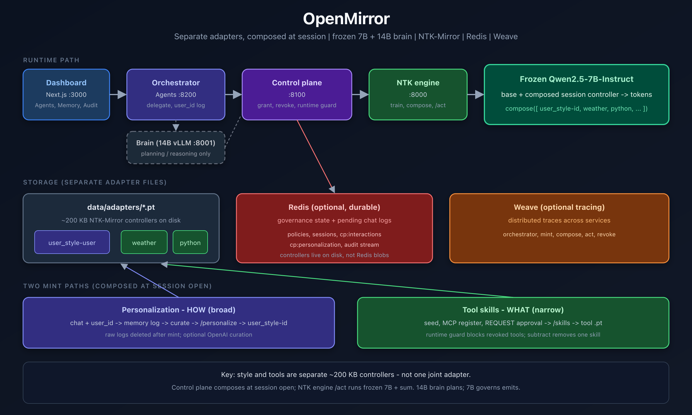

# OpenMirror

**Local agent platform — overnight weight-memory for *how you talk*, governed composable skills for *what you can do*, on models you host.**

Closed APIs send your prompts to someone else's server. Context-window "memory" re-reads a growing transcript every turn — it rots, costs tokens, and drifts. Prompt guards ("don't use tool X") are jailbreakable: the capability is still in the model.

OpenMirror treats **both** personalization and permissions as the same object: **~200 KB NTK-Mirror controllers** on a frozen Qwen2.5-7B. Compose to add, subtract to revoke, mint in ~36 s. Raw chat logs consolidate into weights overnight, then get **deleted**. Your data stays on your box.

Built on [NTK-Mirror](https://github.com/leochlon/ntkmirror) skill arithmetic — LoRA can't subtract cleanly; prompts can't revoke cleanly. This can.

---

## Adapter model (read this — we are explicit)

OpenMirror creates **separate adapters**, not one adapter that learns tools and personality together.

| Adapter type | ID pattern | Trained on | Scope | Updates |
|--------------|------------|------------|-------|---------|
| **Personalization** | `user_style-{user_id}` | Styled chat pairs (tone, format, verbosity — **HOW**) | **Broad** — biases every reply | Consolidation → `POST /personalize` |
| **Tool** | `weather`, `python`, `arxiv_search`, … | Tool-call pairs (`weather("Paris")`) — **WHAT you may emit** | **Narrow** — fires on matching prompts only | Seed, register MCP, or self-improvement → `POST /skills` |

**We do not** train a single adapter on mixed tool + style examples.

**At session time**, the control plane **composes** separate stored adapters:

```
session_controller = compose([ user_style[u_123], weather, calculator, python ])
```

Validated by `smoke_style_plus_tool.py`.

---

## Architecture



Full detail: [`docs/ARCHITECTURE.md`](docs/ARCHITECTURE.md) · editable source: [`docs/architecture.svg`](docs/architecture.svg)

| Service | Port | Role |
|---------|------|------|
| **Dashboard** | 3000 | Chat, agents, memory panel, policies, approvals, audit |
| **Orchestrator** | 8200 | Multi-agent delegation + governed workers |
| **Control plane** | 8100 | Policy, sessions, memory log, `/personalize`, runtime guard |
| **NTK engine** | 8000 | Train / compose / act on frozen Qwen2.5-7B |
| **Brain** | 8001 | Qwen2.5-14B via vLLM — reasoning only |
| **Memory** | CLI | `python -m memory.consolidate` — curate → `/personalize` → delete logs |

**WeaveSelf reference:** `ml/weaveself/` (merged from `main`) holds the original consolidation research code; OpenMirror's production path mints style controllers via the NTK engine only. Architecture: [`docs/ARCHITECTURE.md`](docs/ARCHITECTURE.md). Adapter contract: [`PERSONALIZATION.md`](PERSONALIZATION.md).

---

## Live demo

1. **Memory** — Chat with `user_id` → **Consolidate** → `user_style-{id}` minted; raw logs deleted.
2. **Governance** — Revoke `weather` → governed model stops emitting it.
3. **Both** — Orchestrator with `user_id` + tools → your style **and** governed capabilities.

---

## Run it

```bash
cd ~/weave-hack && bash setup_brev.sh
bash start_all.sh
brev port-forward <instance> --port 3000:3000   # laptop → :3000
```

Consolidate a user's chats (after logging interactions via UI or `POST /memory/log`):

```bash
python -m memory.consolidate --user alice
```

---

## Repo map

```
engine/ + controller_service.py          NTK engine
control_plane/ + control_plane_service.py    Control plane (+ memory endpoints)
agents/ + agent_service.py               Orchestrator
ui/                                      Dashboard
memory/                                  Production memory loop (log → curate → personalize)
ml/weaveself/                            WeaveSelf research code (merged from main)
PERSONALIZATION.md                       Adapter contract
```

---

## Thesis

**Who you are and what you can do should both be small composable weight controllers — grantable, revocable, consolidatable — on hardware you control.**
