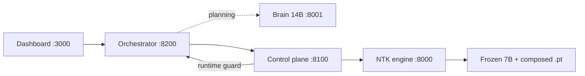

# OpenMirror architecture

Source diagram: [`architecture.svg`](architecture.svg) (export to PNG for README if needed).

## Services

| Service | Port | Package | Role |
|---------|------|---------|------|
| **Dashboard** | 3000 | `ui/` | Next.js UI: agents, memory panel, capabilities, approvals, audit. CopilotKit sidebar is optional chat chrome. |
| **Orchestrator** | 8200 | `agents/` + `agent_service.py` | Decomposes tasks, runs governed worker loops, optional `user_id` for style compose + interaction logging. |
| **Control plane** | 8100 | `control_plane/` | Policy, sessions, grant/revoke/compose, runtime guard, `/personalize`, `/memory/*`, audit. |
| **NTK engine** | 8000 | `engine/` + `controller_service.py` | NTK-Mirror train / compose / subtract / act on **frozen Qwen2.5-7B-Instruct**. |
| **Brain** | 8001 | vLLM | **Qwen2.5-14B-Instruct** — planning and reasoning for the orchestrator only; not the governed actuator. |
| **Memory** | CLI / API | `memory/` | Log → curate → `POST /personalize` → delete raw logs. |

## Adapter model (non-negotiable)

Two adapter **types**, stored as separate `.pt` files under `data/adapters/`:

| Type | ID | Learns | Mint |
|------|-----|--------|------|
| Personalization | `user_style-{user_id}` | HOW (tone, format) | Consolidation → `/personalize` |
| Tool | `weather`, `python`, … | WHAT to emit | `/skills`, MCP register, self-improve approval |

**Not** one adapter trained on mixed style + tool examples.

At session open, the control plane calls the NTK engine to compose:

```
session_controller = compose([ user_style-alice, weather, python ])
```

Then `/act` runs inference with the frozen 7B + composed controller. Revoking `weather` subtracts only that tool controller; `user_style-alice` is unchanged.

## Runtime flow



## Storage

- **Controllers:** `data/adapters/*.pt` (~200 KB each). NTK engine owns train/compose/subtract.
- **Redis (optional):** policies, sessions, personalization index, pending interaction logs (`cp:interactions`), audit stream. Controllers are **not** stored as Redis blobs in the production path.
- **Weave (optional):** distributed traces across services.

## Personalization loop

1. User chats with `user_id` (UI or `POST /run`) → orchestrator logs `(task, final_answer)` via `POST /memory/log`.
2. Consolidate (UI, `POST /memory/consolidate`, or `python -m memory.consolidate --user alice`).
3. `memory/` curates pairs → control plane `POST /personalize` → NTK engine mints `user_style-{id}`.
4. Raw logs deleted; memory lives in the adapter weights.
5. Next session with same `user_id` composes style + authorized tools.

## Tool governance loop

1. Register skill (seed, MCP/HTTP, or agent `REQUEST` + approval).
2. NTK engine mints narrow tool controller from call-format examples.
3. Control plane grants into session policy; runtime guard blocks unauthorized emits.
4. Revoke mid-session → subtract tool controller; session continues with remaining skills + style.

## Legacy / reference

- **`ml/weaveself/`** — WeaveSelf research code merged from `main`; separate trainer/serving path, not production OpenMirror.
- **`app/`** — legacy Vite WeaveSelf UI; production UI is `ui/`.
- **`PROJECT_CONTEXT_README.md`** — original hackathon WeaveSelf context; see this doc + root `README.md` for the unified product.
